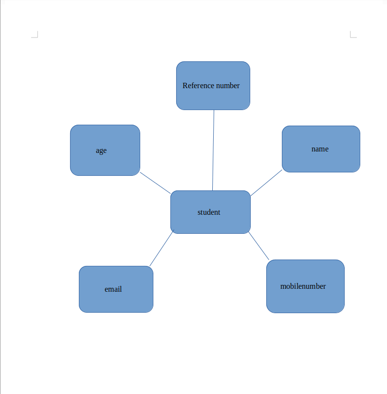

# Django ORM Web Application

## AIM
To develop a Django application to store and retrieve data from a database using Object Relational Mapping(ORM).

## Entity Relationship Diagram


## DESIGN STEPS

### STEP 1:Create folder 'ex02' under the directory 'unit2'

### STEP 2:Clone the Github repository into the directory 'ex02' using the command "git clone <url>"

### STEP 3:Under the folder "django-orm-app",enter the directory titled "dataproject" and enter the folder "dataproject" and go to the file "settings.py"mp, "iort.os" in line 14,set ALLOWED_HOSTS=['*'] and add 'myapp' under the list INSTALLED_APPS.

### PROGRAM:
### models.py:
```py
from django.db import models

from django.contrib import admin
# Create your models here.

class Student(models.Model):
    referencenumber=models.CharField(primary_key=True, max_length=20,help_text="reference number")
    name=models.CharField(max_length=100)
    age=models.IntegerField()
    email=models.EmailField()
    number=models.IntegerField()


class StudentAdmin(admin.ModelAdmin):
    list_display=('referencenumber','name','age','email','number')
```

### admin.py:
```py
from django.contrib import admin
from .models import Student,StudentAdmin
# Register your models here.
admin.site.register(Student,StudentAdmin)
```


## OUTPUT

### Student List:


### Error:


## RESULT
The program is executed successfully.
